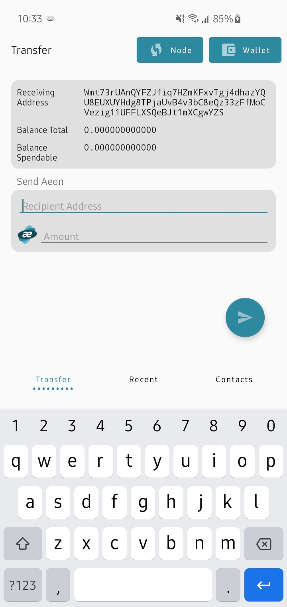
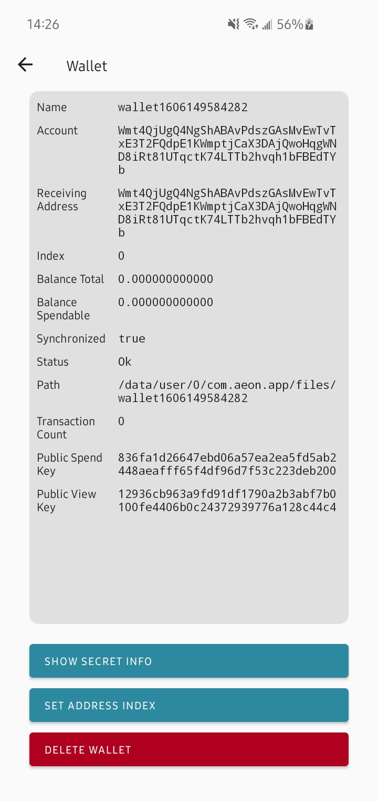

  
  

# BETA TESTING

Please use this with caution. All software and code on this repository is provided without warranty, as-is. You risk losing all aeon.

# aeonwallet

An original android wallet app built for Aeon.

## Download.

Find the apk files in https://github.com/ivoryguru/aeonwallet/tree/main/app/release. Most android phones will use the `app-arm64-v8a-release.apk`.

## Build instructions.

Some minor changes to aeon source code are necessary before compiling. Please see the changes https://github.com/ivoryguru/aeon/commits/master.

Next, change directory to `external-libs` and run `sudo make install`. This will create the necessary lib files for the app.

After this is all completed, you will be able to open the app in Android Studio and build.

## Thanks

Cheers to m2049r for the exemplary app xmrwallet and build scripts. https://github.com/m2049r/xmrwallet

